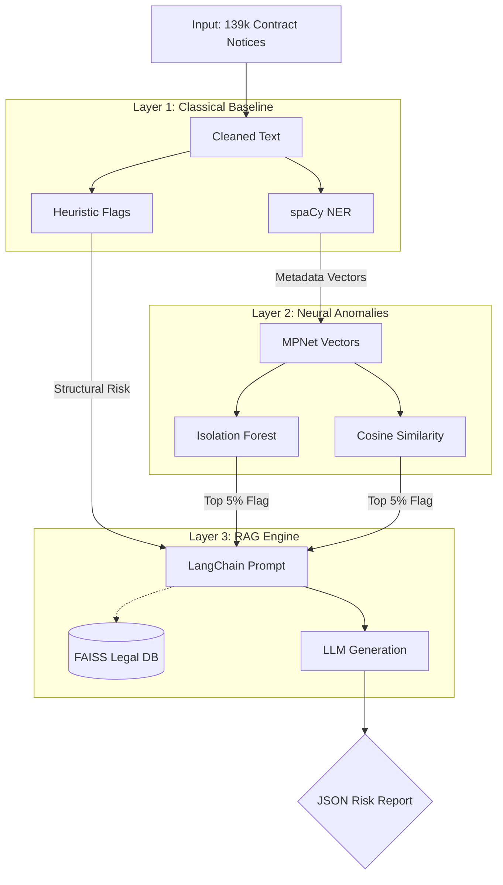

# NLP-Fraud-Detection-project
Public Procurement Collusion & Fraud Detector

👥 The Team

[Malcolm Palmer]

[Nourhene Ben Juddou]

[Giulia Lorelli]

[Brian O'Sullivan]

## Developed for Bologna Buisness School - Master's in AI & Innovation Management

---

## 🤖 0. AI Assistance & Tooling

In the spirit of transparency and modern data science workflows, our team utilized LLMs as pair-programming assistants to accelerate the development pipeline.

* **AI Tools Utilized:** Google Gemini, Anthropic Claude, and OpenAI Codex.
* **Scope of Assistance:** These tools were strictly used for coding tasks, including drafting Python boilerplate, constructing complex Regular Expressions for text cleaning (`spaCy` / `pandas`), troubleshooting library dependency errors, and generating plot formatting code for our evaluation visualizations.
* **Human Oversight:** All core architectural decisions, data labeling logic, mathematical feature engineering, model selection, and final evaluations were independently designed, reviewed, and validated by the human project team.

---

## 1. Project Overview
Public procurement accounts for roughly 14% of EU GDP. Irregularities; ranging from bid rigging and single-tendering abuse to inflated contract values and winner concentration, cost European taxpayers an estimated **EUR 5-25 billion per year**. 

This project tackles this systemic problem by building a multi-layered NLP framework that ingests, cleans, analyzes, and explains potential fraud patterns within public sector data.

## 2. Ethical Context
⚠️ Legal & Ethical Disclaimer

**Academic Purpose Only:** This project is an experimental prototype developed solely for academic purposes as part of our Master's degree program. It is not intended for, nor should it be used for, actual legal, financial, or regulatory auditing, compliance, or enforcement.

**Experimental AI & False Positives:** The models and algorithms utilized in this repository (including NLP similarity scoring and anomaly detection) are experimental. Machine learning models are inherently probabilistic and subject to false positives. A high "risk score" or "anomaly flag" generated by this tool **does not** constitute evidence of fraud, collusion, cartel behavior, or any illegal activity. It merely indicates a statistical deviation in text structure that warrants human review.

**Open Data Usage:** The data processed by this tool is sourced from publicly available datasets (OpenTender). The developers of this tool make no claims regarding the accuracy, completeness, or currentness of the underlying public data. 

**No Accusation of Wrongdoing:** Any names of real companies, public authorities, or individuals that appear in the sample data, visualizations, or output of this tool are incidental. This system does not accuse any real-world entity of wrongdoing.

* **Primary Data Source:** [Tenders Electronic Daily (TED)](https://ted.europa.eu) — the official EU public procurement journal. It publishes approximately 700,000 notices per year across all 24 EU official languages.

* **Data Access:** Machine-readable subsets are ingested via OpenTender.eu.

### 🚩 Typology of Targeted Irregularities
Our pipeline focuses on identifying specific "red flags" defined by procurement and anti-fraud frameworks:
* **Single-Bidding / Lack of Competition:** Only one tender is received for a given competitive contract.
* **Winner Concentration:** The exact same supplier repeatedly wins contracts from the same public buyer.
* **Abnormally Short Tender Period:** Insufficient or artificially narrow time windows allocated for competitors to submit bids.
* **Copy-Paste Descriptions:** Identical or near-identical notices issued by different buyers, indicating potential collusion or pre-written specs.
* **Entity-Linked Red Flags:** Shared addresses, contact information, or registration details across multiple distinct bidders (detected via NER).

---

## 🛠️ 3. Full NLP Technology Stack

| Layer | Tool / Model | Course Module Alignment |
| :--- | :--- | :--- |
| **Data Preprocessing** | `pandas`, `re` (Regex) | Module 1: Foundational Text Processing |
| **Text Vectorization** | `scikit-learn` (`TfidfVectorizer`) | Module 2: Text Representations |
| **Sentence Embeddings** | `sentence-transformers` (`paraphrase-multilingual-mpnet-base-v2`) | Module 2: Contextual Vectors |
| **Classification Models** | `LogisticRegression` (TF-IDF & Structured Features) | Module 2: Classical Classification |
| **Anomaly Detection** | `IsolationForest` (on Embeddings) | Module 2 & 3: Unsupervised Landscapes |
| **NER Extraction** | `spaCy` (`en_core_web_trf` Transformer Pipeline) | Module 3: Sequence Labeling |
| **RAG Pipeline** | `LangChain`, `FAISS` | Module 4: Generative Frameworks |
| **Structured Output** | `Pydantic` (JSON Schema Constraints) | Module 4: Production LLM Design |
| **Evaluation Framework** | `scikit-learn` metrics (PR-AUC, Precision, Recall) | Module 4 & 5: Validation |

---

## 🏗️ 4. System Architecture

The analytical application relies on three distinct, decoupled layers configured to optimize computation footprint, eliminate unnecessary API costs, and prevent LLM hallucination:

### 🔹 Layer 1 — Classical Detection Baseline
**Text + NER Flags** ➔ **TF-IDF & Scaler** ➔ **Logistic Regression** ➔ **Baseline Risk Score**

### 🔹 Layer 2 — Deep Vector Anomalies & Similarity
**Contract Text** ➔ **MPNet Transformer** ➔ **Dense Vectors** ➔ **Isolation Forest & Cosine** ➔ **Anomaly Flag**

### 🔹 Layer 3 — RAG Explanation Engine
**Flagged Notice** ➔ **FAISS Legal Index Query** ➔ **Context-Injected Prompt** ➔ **LLM Processing** ➔ **JSON Risk Report**

> 📌 **Architectural Note:** Layers 1 and 2 run completely local and offline in batch processing configurations at negligible compute cost. Layer 3 (External LLM API invocation) triggers dynamically *only* when a record successfully breaches the anomaly thresholds set by Layer 2. This cascading structure maintains tight latency boundaries, manages production API budgets efficiently, and prevents the LLM from wasting time on safe, boilerplate contracts.



---

## 🚀 5. Data Ingestion Repositories
* **[OpenTender.eu](https://opentender.eu):** Provides access to structured versions of historical TED data. Features internal risk index parameters (`single_bid`, `tender_period`).

---

## 📂 6. Repository Structure Diagram

```text
├── .gitignore          # Hides local large .csv and .npy files
├── README.md           # Project documentation and architecture
├── data/               
│   ├── sample_contracts.json       # Safe mock rows for GitHub viewers
│   ├── contracts_ie_clean.csv      # (Local) Full preprocessed dataset
│   ├── ner_features.csv                 
├── notebooks/          
│   ├── 01_preprocessing_eda.ipynb          
│   ├── 02a_features_embeddings_clean.ipynb
│   ├── 02b_ner_extraction.py
│   ├── 03_detection_models.ipynb           
│   └── 04_rag_explainability.ipynb        
├── src/                
│   ├── pipeline.py     # Global utility cleaning and data transforms
├── models/             
│   ├── tfidf_vectorizer.joblib
│   ├── structured_scaler.joblib
│   ├── model_logreg_tfidf.joblib
│   └── model_logreg_tfidf_structured.joblib
│
└── results/            # Proof of Work: Evaluation metrics and audit reports
  ├── model_comparison.csv            # Final precision, recall, and PR-AUC scores
    ├── precision_recall_curves.png     # Visual evaluation metrics
    ├── anomaly_scores.csv              # Isolation Forest outlier rankings
    ├── false_positives_sample.csv      # Error analysis diagnostics
    ├── false_negatives_sample.csv      # Error analysis diagnostics
    ├── retrieved_contexts.csv          # Legal text fetched by FAISS
    └── risk_report_demo.json           # Final RAG LLM Output
